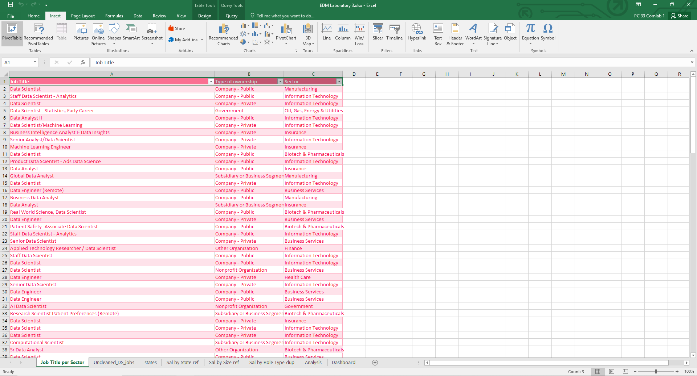
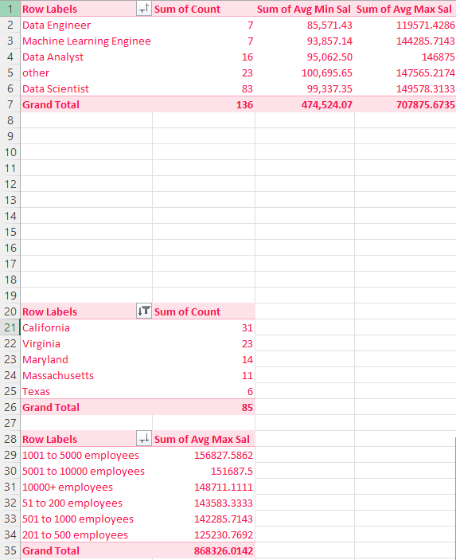
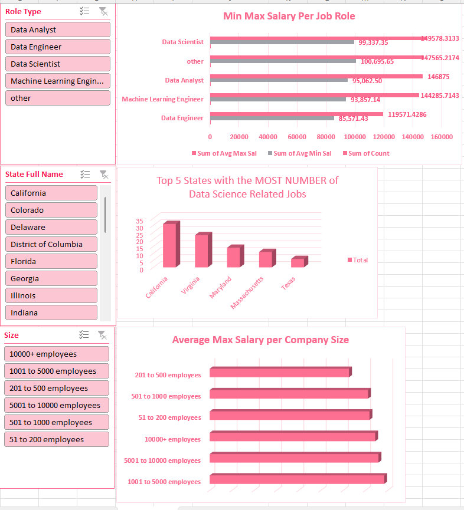
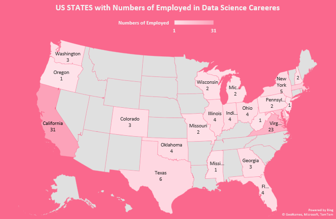
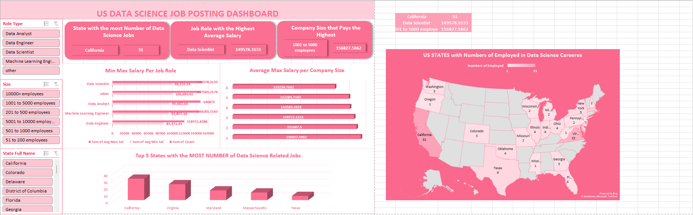

# Midterm Lab Task 3 - Creating PIVOT TABLE and DASHBOARD
In this lab, I worked on organizing and showing data using Pivot Tables and a Dashboard in Excel. The dataset, Uncleaned_DS_Jobs.csv, was used to find useful insights about salaries, job roles, and hiring trends in data science.
## Step 1. Prepared the Data
- Used tables: Sal By Role, Sal By State, Sal By Size
- Created extra tables to check job sectors.
## Step 2. Created a Dashboard with These Insights:
- The state with the most data science jobs.
- The job role with the highest average salary.
- The company size that pays the most.
- The sector with the least and most data science jobs.
- The sector with the lowest and highest average salary.
## Step 3. Used Pivot Tables and Charts to Show Data
- Made Pivot Tables to group salaries by role, state, and company size.
- Created charts to make the data easy to understand.
## Step 4. Made the Dashboard Better
- Added slicers to filter data by Role, Company Size, and State.
- Used a map chart (Excel 2019 and above) to show salaries by state.
- Designed the dashboard to look clean and easy to read.
## Here's the screenshot of my output before I started creating pivot tables and charts (See screenshot)

## Here's the screenshot of my output before after I started creating pivot tables and charts (See screenshot)
- Pivot Table for each analysis

- Slicers and Filters

- Map

- Here's the Final Dashboard Output

